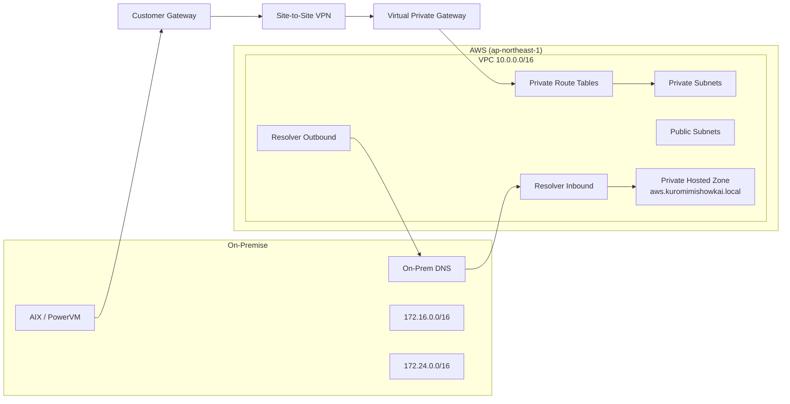

# Hybrid Architecture: AIX / PowerVM から AWS への段階的移行モデル

本リポジトリは、オンプレミスの AIX / PowerVM 環境から AWS へ段階的に移行するための  
**ハイブリッド構成設計モデル（Terraformプロトタイプ）** です。

単なるAWSリソース構築ではなく、

- ハイブリッド接続設計
- DNS統合
- 段階移行思想
- IaCによる再現性

を示すことを目的としています。

---

## 1. 設計コンセプト

### Phase 1：ハイブリッド基盤確立

オンプレミスを停止せずに AWS を拡張し、

- ネットワーク接続（VPN）
- ルーティング
- 双方向DNS統合

を確立します。

将来的なアプリ移行は Phase 2 以降で実施します。

---

## 2. 想定オンプレミス環境（架空）

| 項目 | 値 |
|------|------|
| Primary DC | 172.16.0.0/16 |
| DR Site | 172.24.0.0/16 |
| DNS Domain | kuromimishowkai.local |
| OS | AIX / PowerVM |
| 想定構成 | SANブート / PowerHA |

※ すべて架空値です（設計モデル提示のみが目的）

---

## 3. AWS環境

- Region: ap-northeast-1（東京）
- VPC: 10.0.0.0/16
- Public Subnet ×2
- Private Subnet ×2
- Internet Gateway
- Private Route Tables

Private Route Tables には以下を設定：

- 172.16.0.0/16 → VGW
- 172.24.0.0/16 → VGW

---

## 4. 全体構成図



------------------------------------------------------------------------

## 5. ハイブリッド接続（VPN）

### Terraformで構築：

-   Virtual Private Gateway
-   Customer Gateway（ダミーIP）
-   Site-to-Site VPN
-   Static Routes
-   Private Route Table 設定

⚠ VPNトンネルは未接続のため DOWN 状態が正常です。

------------------------------------------------------------------------

## 6. ハイブリッドDNS設計

### 6.1 Outbound Resolver（AWS → On-Prem）

-   kuromimishowkai.local
-   On-Prem DNS（172.16.10.10 / 172.24.10.10）へ FORWARD

### 6.2 Inbound Resolver（On-Prem → AWS）

-   On-Prem DNS が Inbound Endpoint IP に転送
-   AWS VPC 内 Private Hosted Zone を参照可能

------------------------------------------------------------------------

## 7. Private Hosted Zone

### 作成済み：
```text
aws.kuromimishowkai.local
```

### サンプルレコード：
```text 
app.aws.kuromimishowkai.local → 10.0.10.100
```

### 想定動作：
```text 
On-Prem → Inbound Endpoint → PHZ → 応答
```

------------------------------------------------------------------------

## 8. Terraform Outputs（dev環境）
```text
onprem_cidr_blocks = [
  "172.16.0.0/16",
  "172.24.0.0/16",
]

vpc_id            = "vpc-xxxxxxxx"
vpn_gateway_id    = "vgw-xxxxxxxx"
vpn_connection_id = "vpn-xxxxxxxx"

resolver_inbound_ip_addresses = [
  "x.x.x.x",
  "x.x.x.x"
]
```

------------------------------------------------------------------------

## 9. ディレクトリ構成
```
modules/
  ├── vpc
  ├── vpn_s2s
  ├── route53_resolver
  ├── private_hosted_zone

envs/
  └── dev
```

------------------------------------------------------------------------

## 10. デプロイ手順

``` bash
cd envs/dev

terraform init
terraform validate
terraform plan
terraform apply
```

削除：
``` bash
terraform destroy
```

------------------------------------------------------------------------

## 11. 移行ロードマップ

### Phase 1（本リポジトリ）

-   ハイブリッド接続確立
-   双方向DNS統合
-   IaC化

### Phase 2（想定）

-   アプリケーション再設計
-   コンテナ化
-   マネージドDB移行
-   運用監視統合


------------------------------------------------------------------------

## 12. 設計思想

本モデルは以下を前提とします：
-   エンタープライズAIX環境
-   SANブート
-   PowerHA構成
-   段階移行前提

単純な Lift & Shift ではなく、
**制御された変革（Controlled Transformation）** を目指します。

------------------------------------------------------------------------

## Author

関野 智勝[@TomomasaSekino](https://github.com/TomomasaSekino)
AIX / PowerVM インフラエンジニア
AWS ハイブリッド設計への移行を推進中

本リポジトリは「AWS構築」ではなく
移行設計力の提示 を目的としています。
