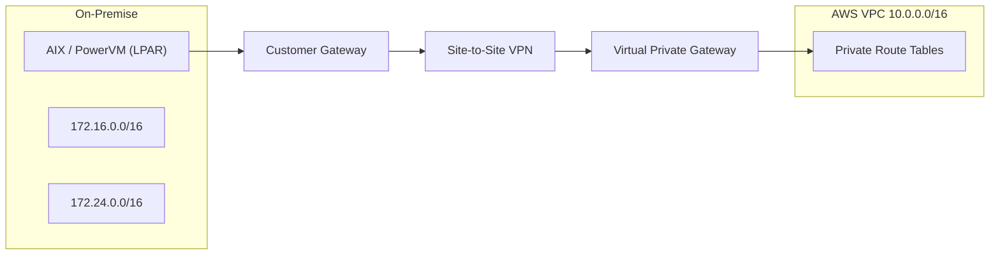

# Hybrid Architecture: AIX / PowerVM から AWS への段階的移行（Terraformプロトタイプ）

本リポジトリは、オンプレミスの AIX / PowerVM 環境から AWS
へ段階的に移行するための **ハイブリッド構成設計モデル**
を示したものです。

目的： - 既存オンプレ環境を停止せずにAWSを拡張する設計 -
移行を段階化し、業務継続性を担保する - Terraform による再現可能な IaC
設計の提示

------------------------------------------------------------------------

## 1. アーキテクチャ概要

### Phase 1 -- ハイブリッド接続確立

オンプレミス環境を維持したまま AWS
をデータセンター拡張として接続します。\
接続方式は **AWS Site-to-Site VPN** を採用しています。

------------------------------------------------------------------------

## 2. 想定オンプレミス環境（プロトタイプ用）

-   Primary DC: 172.16.0.0/16
-   DR Site: 172.24.0.0/16
-   オンプレDNSドメイン: kuromimishowkai.local

※ すべて架空値です（設計モデル提示のみが目的）。

------------------------------------------------------------------------

## 3. AWS構成

-   リージョン: ap-northeast-1（東京）
-   VPC: 10.0.0.0/16
-   Public Subnet ×2
-   Private Subnet ×2
-   Private Route Tables にオンプレCIDRをVGWへ転送

------------------------------------------------------------------------

## 4. ハイブリッド接続構成（Mermaid）



------------------------------------------------------------------------

## 5. Terraform Outputs（dev）

``` text
onprem_cidr_blocks = [
  "172.16.0.0/16",
  "172.24.0.0/16",
]

vpc_id            = "vpc-0d760f1e3f885ecf6"
vpn_gateway_id    = "vgw-0e08ed15e84323fa8"
vpn_connection_id = "vpn-0d97a20f1f837d683"
```

※ VPNトンネルは未接続のため DOWN 状態が正常です。

------------------------------------------------------------------------

## 6. ディレクトリ構成

    modules/
      ├── vpc
      ├── vpn_s2s

    envs/
      └── dev

------------------------------------------------------------------------

## 7. デプロイ手順

``` bash
cd envs/dev
terraform init
terraform validate
terraform plan
terraform apply
```

削除:

``` bash
terraform destroy
```

------------------------------------------------------------------------

## 8. 移行ロードマップ

Phase 1: - ハイブリッド接続確立 - ルーティング設計

Phase 2: - アプリ再設計 - コンテナ化 - マネージドDB移行 - DNS統合 -
運用監視統合

------------------------------------------------------------------------

## 9. 設計前提

-   エンタープライズ規模AIX環境
-   SANブート構成
-   PowerHAクラスタ
-   段階的移行

------------------------------------------------------------------------

## 10. 今後の拡張

-   Route 53 Resolver
-   SSM運用モデル
-   CloudWatch統合
-   CloudTrail / AWS Config
-   Transit Gateway

------------------------------------------------------------------------

## Author

関野 智勝
